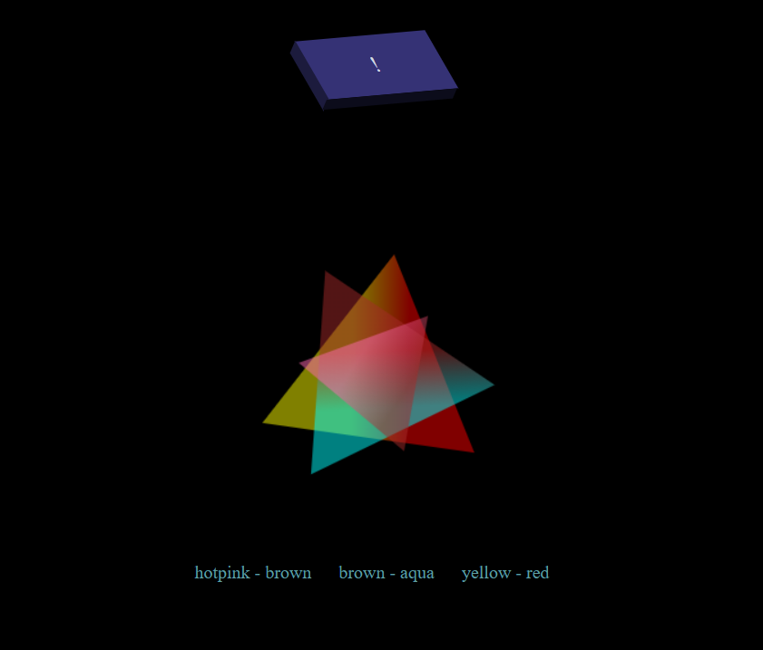
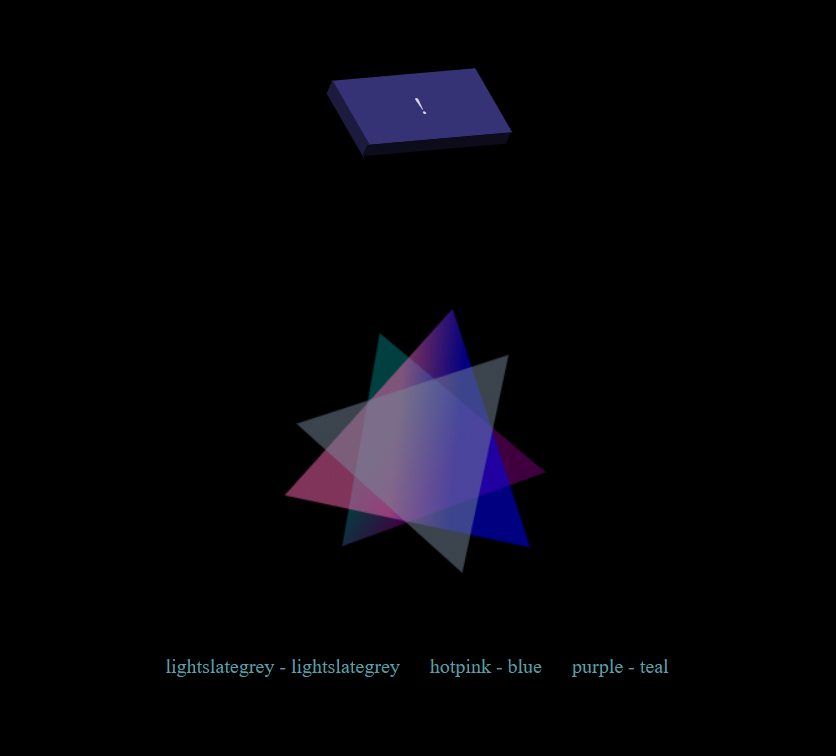

# generateur de forme
### pour tester : https://compassionate-khorana-01072b.netlify.app/
## utilisation de l'API canvas
test sur la génération de trois triangles de taille aléatoire,  tournant das des sens aléatoirement déterminés, et comportant des dégradés aléatoires.

En dehors du test simple de l'utilisation des méthodes baiques de l'API canvas, le test vise à montrer en seconde lecture la portée, l'importance du facteur hasard dans la création, et son poids de ce que l'on peut trouver harmonieux, ou on contraire disharmonieux.

